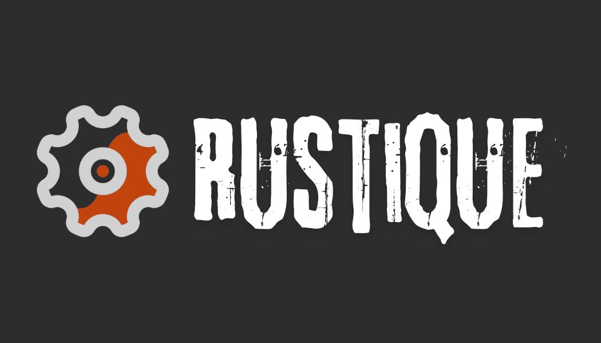
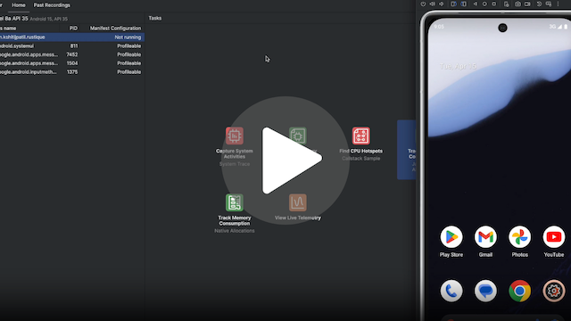

# rustique

Example project showcasing cross-platform sdk development for
mobile apps using Rust. While operations shown in this demo
may seem trivial, building such SDKs start making sense when
we are dealing with live data streams (text/audio/video) where
we need granular control over the memory management.

# Demo

Following demo shows fast image manipulations with limited memory
usage by operating directly on the native memory (outside Java heap)

# Download

# Setup

Refer [setup](docs/Setup.md) to learn more

# How does this work?

Refer [High Level Flow](docs/High-level-flow.md) to learn more